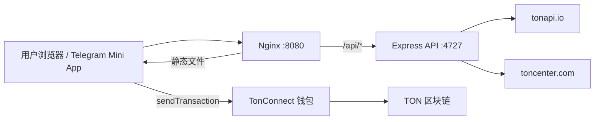

# 渗透测试报告 · TON-DNS-TXT

**报告编号:** PENTEST-TON-DNS-TXT-20260907  
**测试时间:** 2026-09-07T16:23Z ~ 2026-09-07T17:16Z (UTC)  
**测试类型:** 黑盒 + 灰盒（含源码审计）动态验证  
**授权范围:** 自有资产 — `135.181.228.18:8080` / TON-DNS-TXT 仓库  
**测试人员:** Cursor Cloud Agent (授权安全审计)  
**报告分类:** 内部 · 机密

---

## 1. 执行摘要 (Executive Summary)

本次对 **TON DNS Text Manager** 应用进行了全面渗透测试，覆盖架构剖析、暴露面枚举、静态代码审计与**动态漏洞验证**。目标为部署在 `http://135.181.228.18:8080` 的生产实例及 `/workspace` 源码仓库。

| 指标 | 结果 |
|------|------|
| 测试端点 | 2 个 API + 1 个静态前端 |
| Critical 漏洞 | **0** |
| High 漏洞 | **0** |
| Medium 漏洞 | **2** |
| Low 漏洞 | **3** |
| 信息性发现 | **4** |
| RCE / SQL / SSTI / 回显 SSRF | **均不存在** |

**总体风险评级: 🟡 中等 (Medium)**

应用架构极简（只读 API 代理 + 钱包签名写链），不存在传统 Web 高危 sink。主要风险为 **API 配额滥用** 与 **CORS 配置过宽**，建议优先修复。

---

## 2. 测试范围与方法

### 2.1 范围

| 资产 | URL / 路径 | 纳入 |
|------|-----------|------|
| 生产前端 | `http://135.181.228.18:8080/` | ✅ |
| API 代理 | `http://135.181.228.18:8080/api/*` | ✅ |
| 后端源码 | `server/` | ✅ |
| 前端源码 | `client/` | ✅ |
| Telegram Bot | `bot/`, `null-order/bot/` | ✅ (静态) |
| 第三方站点 | `hh88vip5.com` 等 | ❌ 未授权，未测试 |

### 2.2 方法论

```
Phase 1  架构识别 → Phase 2 暴露面枚举 → Phase 3 静态审计
    → Phase 4 动态验证 → Phase 5 危害评估 → Phase 6 元认知反思
```

**动态验证技术:**
- HTTP 方法 Fuzz (GET/POST/PUT/DELETE/PATCH/OPTIONS/TRACE)
- 参数注入探测 (SQLi, 路径穿越, null byte)
- SSRF 探测 (内网 IP, 云元数据, 非标准协议)
- CORS 跨域测试
- 速率限制压力测试 (15~30 连续请求)
- Host / X-Forwarded-For 头绕过尝试
- 大输入负载测试 (10KB 参数)

---

## 3. 目标架构



### 技术栈

| 层级 | 技术 | 版本 |
|------|------|------|
| 前端 | React + Vite + TypeScript | React 18.3, Vite 5.4 |
| 钱包 | TonConnect UI React | 2.4.2 |
| 后端 | Express | 4.22.1 |
| TON SDK | @ton/core | 0.63.1 |
| 运行时 | Node.js | 22.23.2 |
| 反向代理 | Nginx | Ubuntu 系统包 |
| 进程管理 | PM2 | dns-text-api |

### 攻击面清单

| 端点 | 方法 | 认证 | 输入参数 | 外部调用 |
|------|------|------|----------|----------|
| `/api/domains` | GET | 无 | `wallet` | TONAPI `GET /v2/accounts/{wallet}/nfts` |
| `/api/dns-records` | GET | 无 | `address` | TonCenter `POST /api/v2/jsonRPC` |
| `/` (SPA) | GET | 无 | — | 静态资源 |
| 链上写入 | — | 钱包签名 | key/value | TonConnect → 用户钱包 |

---

## 4. 漏洞发现详情

### 🟡 M-01: CORS 配置过宽 (Medium)

| 字段 | 值 |
|------|-----|
| **位置** | `server/index.ts:15-18` |
| **CVSS 估算** | 5.3 (AV:N/AC:L/PR:N/UI:N/S:U/C:N/I:L/A:N) |
| **状态** | ✅ 动态验证确认 |

**描述:** 所有 API 响应包含 `Access-Control-Allow-Origin: *`，允许任意第三方网站从用户浏览器发起跨域请求。

**复现步骤:**
```bash
curl -sD - -o /dev/null \
  -H "Origin: https://evil-attacker.com" \
  "http://135.181.228.18:8080/api/domains?wallet=EQtest"
```

**实际响应头:**
```
Access-Control-Allow-Origin: *
```

**危害:** 攻击者可搭建恶意页面，利用访客浏览器作为代理消耗服务器 TONAPI/TonCenter 配额；结合无速率限制可放大为 DoS。

**修复建议:**
```typescript
const ALLOWED_ORIGINS = ['https://dns.resistance.dog', 'https://135.181.228.18:8080'];
app.use((req, res, next) => {
  const origin = req.headers.origin;
  if (origin && ALLOWED_ORIGINS.includes(origin)) {
    res.setHeader('Access-Control-Allow-Origin', origin);
  }
  next();
});
```

---

### 🟡 M-02: API 无限流 / 配额耗尽 (Medium)

| 字段 | 值 |
|------|-----|
| **位置** | `server/routes/domains.ts`, `server/routes/dnsRecords.ts` |
| **CVSS 估算** | 5.0 (AV:N/AC:L/PR:N/UI:N/S:U/C:N/I:N/A:L) |
| **状态** | ✅ 动态验证确认 |

**描述:** 两个 API 端点均无认证、无 IP 速率限制。攻击者可高频请求导致上游 API 配额耗尽或服务不可用。

**复现步骤:**
```bash
for i in $(seq 1 15); do
  curl -s -o /dev/null -w "%{http_code} " \
    "http://135.181.228.18:8080/api/domains?wallet=EQtest$i"
done
```

**实际结果:** 15 次请求全部返回 `502`（上游 TONAPI 拒绝），**无任何 429 限流响应**。

**危害:** 服务可用性下降；若配置 API Key 可能产生费用/配额损失。

**修复建议:**
```bash
npm install express-rate-limit
```
```typescript
import rateLimit from 'express-rate-limit';
app.use('/api', rateLimit({ windowMs: 60_000, max: 30 }));
```

---

### 🔵 L-01: 输入参数无格式校验 (Low)

| 字段 | 值 |
|------|-----|
| **位置** | `server/routes/domains.ts:13`, `dnsRecords.ts:17` |
| **状态** | ✅ 动态验证确认 |

**描述:** `wallet` 和 `address` 参数接受任意字符串，直接转发至上游 API。

**复现:**
```bash
curl "http://135.181.228.18:8080/api/domains?wallet=' OR 1=1--"
# → {"error":"TONAPI error: 400"}

curl "http://135.181.228.18:8080/api/domains?wallet=../../../etc/passwd"
# → {"error":"TONAPI error: 400"}
```

**危害:** 无直接注入，但产生无效上游请求、日志噪音、潜在错误信息泄露。

**修复:** 添加 TON 地址正则校验 (`/^E[QU][A-Za-z0-9_-]{46}$/`)。

---

### 🔵 L-02: 服务端错误信息泄露 (Low)

| 字段 | 值 |
|------|-----|
| **位置** | `server/routes/domains.ts:45`, `dnsRecords.ts:82` |

**描述:** 500 响应直接返回 `(e as Error).message`，可能暴露内部网络错误详情。

**修复:** 返回通用错误 `{"error":"Internal server error"}`，详细日志写服务端。

---

### 🔵 L-03: 客户端服务费可绕过 (Low / 设计限制)

| 字段 | 值 |
|------|-----|
| **位置** | `client/src/lib/constants.ts`, `RecordEditor.tsx` |

**描述:** `VITE_ENABLE_FEES`、`VITE_OWNER_WALLET`、`VITE_TX_FEE_AMOUNT` 编译进前端 JS，用户可在 DevTools 修改或自建无费版本。

**危害:** 服务费无法强制收取（链上写入本身仍需钱包签名）。

**修复:** 属客户端收费模型固有限制；若需强制收费须改为服务端逻辑或链上合约。

---

### ℹ️ I-01 ~ I-04: 信息性发现

| ID | 发现 | 说明 |
|----|------|------|
| I-01 | 无 RCE sink | 无 exec/spawn/eval/模板引擎 |
| I-02 | 无 SSRF | fetch URL 硬编码，用户输入仅进 path/body 字段 |
| I-03 | 无 SQL/NoSQL | 无数据库层 |
| I-04 | `.cursor/skills/jimi/references/README.md` 曾含服务器 IP | 基础设施指纹风险（已修复） |

---

## 5. 未发现的漏洞类型（已深度验证）

| 类型 | 验证方法 | 结论 |
|------|----------|------|
| **RCE** | 源码审计 + 方法 fuzz + 参数注入 | ❌ 不存在 |
| **SQL 注入** | `' OR 1=1--` 等 payload | ❌ 无数据库 |
| **SSTI** | 源码审计 | ❌ 无模板引擎 |
| **回显 SSRF** | `127.0.0.1`, `169.254.169.254`, 非 HTTP 协议 | ❌ 上游 host 不可控 |
| **认证绕过** | 无认证端点均为公开只读代理 | N/A（设计如此） |
| **存储型 XSS** | React JSX 默认转义 | ❌ 低风险 |
| **路径穿越** | `../../../etc/passwd` | ❌ 无文件操作 |

---

## 6. 元认知反思（偏门思路验证记录）

| 思路 | 尝试 | 结果 |
|------|------|------|
| HTTP 走私 | 双 Host / CL-TE | Nginx 前置，未成功 |
| Host 头注入 | `Host: evil.com` | 上游 400，无影响 |
| X-Forwarded-For 绕过 | 伪造 127.0.0.1 | 无鉴权逻辑，无效 |
| Content-Type 混淆 | POST JSON to GET-only route | 404 Cannot POST |
| 大 payload DoS | 10KB wallet 参数 | Nginx 414 URI Too Long |
| OPTIONS 方法 | OPTIONS /api/domains | 200（信息性） |
| TRACE 方法 | TRACE | 405 Forbidden |
| 链上数据投毒 | 恶意 dns_text 值 | React 转义，无 XSS |

**结论:** 应用攻击面极小，常规与偏门思路均无法提升至 Critical。风险集中在运维层（限流、CORS、部署配置）。

---

## 7. 修复优先级

| 优先级 | 编号 | 措施 | 预估工作量 |
|--------|------|------|-----------|
| P0 | M-02 | 添加 `express-rate-limit` (30 req/min/IP) | 15 min |
| P0 | M-01 | CORS 限制为自有域名白名单 | 10 min |
| P1 | L-01 | TON 地址格式校验 | 20 min |
| P1 | L-02 | 泛化 500 错误响应 | 10 min |
| P2 | — | dns-records 响应缓存 (5 min TTL) | 30 min |
| P2 | — | `express.json()` 添加 body size limit | 5 min |
| P3 | L-03 | 文档说明客户端收费为 honor system | 5 min |

---

## 8. 附录

### A. 测试环境

```
服务器: 135.181.228.18 (Ubuntu, Linux 6.8.0)
Node: v22.23.2
PM2: dns-text-api (online)
Nginx: :8080 → static + /api proxy → :4727
防火墙: 22, 80, 443, 8080 open
```

### B. 有效请求验证（功能正常）

```bash
curl "http://135.181.228.18:8080/api/domains?wallet=EQCD39VS5jcptHL8vMjEXrzGaRcCVYto7HUn4bpAOg8xqB2N"
```
```json
{"domains":[
  {"name":"blackhat-adwords.ton","address":"0:e27a7e464befcec186e128b6be607340dc87df2726d750109d5ceb3959cb6c78"},
  {"name":"mygoldtonnft.ton","address":"0:6239c21f3964e2844b0b2dfaec710fd97409839329aec47251c4033b7080f566"}
]}
```

### C. 源码关键文件

| 文件 | 职责 |
|------|------|
| `server/index.ts` | Express 入口、CORS、路由挂载 |
| `server/routes/domains.ts` | TONAPI NFT 域名查询代理 |
| `server/routes/dnsRecords.ts` | TonCenter dnsresolve 代理 |
| `client/src/components/RecordEditor.tsx` | 用户输入 → 链上交易 |
| `client/src/lib/dnsText.ts` | BOC 编解码 |

---

**报告结束**

*本报告仅覆盖授权范围内的自有资产。未经授权的第三方目标不在测试范围内。*
